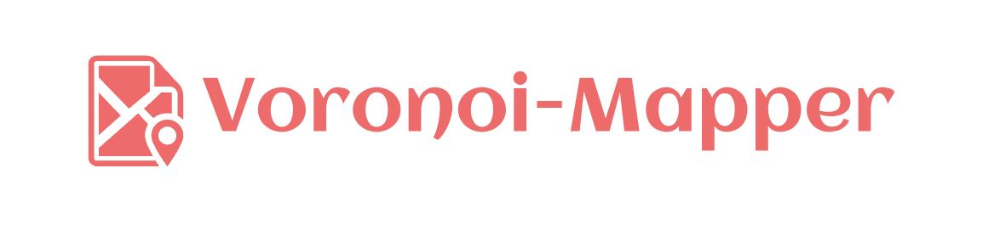
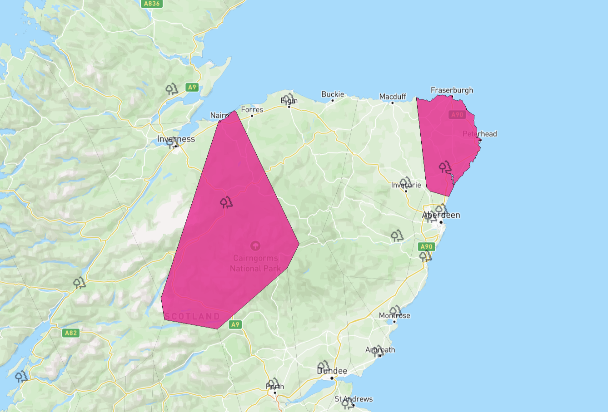

<h1 align="center">
    
</h1>

<div align="center">

[](https://pypi.org/project/voronoi-mapper/)
</div>

# voronoi-mapper

An library to merge voronoi plots with geospatial features.

- [GitHub](https://github.com/jameswalden2/voronoi-mapper)
- [PyPI](https://pypi.org/project/voronoi-mapper/)


## Installation

```bash
pip install voronoi-mapper
```

## Usage

The `scripts/` directory contains scripts to run voronoi and plotting functions.

## Examples

Generate geojson features that clip to geojson boundaries.

<h1 align="center">
    
</h1>